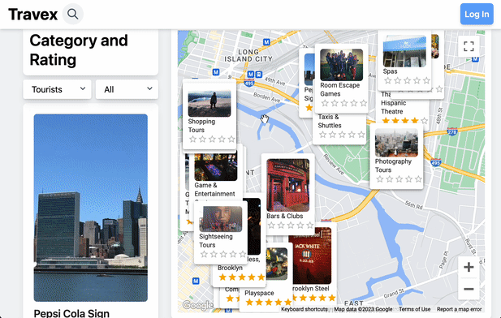

# Travex 

Travex is a web application developed by Nhan Nguyen and Quan Nguyen. It serves as a travelling friend to help users choose hotels, restaurants, and attractions in their incoming destination. The app provides a map and a displaying sidebar containing information about these places and users can filter to find the most suitable options for them.

## Video Walkthrough

GIF created with Kap

## Technologies Used

Travex is built using React and NodeJS with Google Maps API and Travel Advisor API. The user interface is designed using Material-UI and TailwindCSS, and data is fetched using Axios.

## Future Improvements

In the future, the developers plan to implement an authorization system and a notification system. The authorization system will allow users to sign up and sign in to the app, while the notification system will enable users to fill in a form with information about their upcoming trip. The app will then send recommended restaurants, attractions, and hotels based on the user's preferences.

## License

    Copyright [2023] [Nhan Nguyen & Quan Nguyen]
